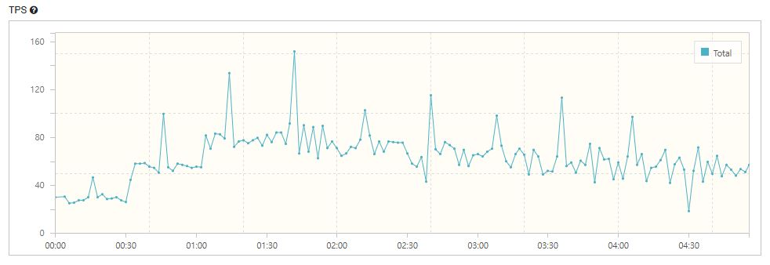
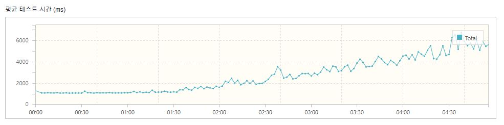

## 테스트 환경
- 도구: nGrinder + Docker
- 구성
  - Docker를 사용해 로컬 환경에서 nGrinder 컨테이너 실행
  - nGrinder Controller: cpu 1core memory 2G 할당
  - nGrinder Agent: cpu 2core memory 6G 할당
- 조건
  - 상품 수량: 상품 5000개의 재고를 100개로 설정.
  - 초기 VUser 수: 30명에서 시작하여 300명까지 점진적으로 증가.
  - Ramp-Up 방식으로 30초마다 30명씩 VUser 수를 증가.
  - 5분 동안 테스트 진행.
## 목표
다수 사용자 요청 시 API의 응답 시간과 TPS 평가

## 대상
주문 생성 API
### 1차 테스트 결과
#### 1. TPS: 63.0 / 최고 TPS: 152

#### 2. 응답 시간: 2,642.05ms (약 2.6초)
